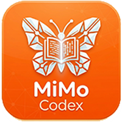

# MiMo-Codex

<p align="center">
  
</p>

<div align="center">

[](https://github.com/yl985211/mimo-codex/stargazers)
[](https://github.com/yl985211/mimo-codex/network/members)
[](https://github.com/yl985211/mimo-codex/issues)
[](https://github.com/yl985211/mimo-codex/blob/main/LICENSE)

</div>

帮小米开发的mimo-codex编程工作台，深度适配小米 MiMo 大模型。
项目是用mimo-v2.5-pro开发完成

## 功能特性

- 桌面端 AI 编程工作台（Electron）
- 支持多种 AI 模型提供商（MiMo、DeepSeek、Kimi 等）
- 多项目、多分支管理
- 实时 Diff 预览
- Computer Use 支持
- IM 适配器（飞书、Telegram、钉钉、WhatsApp）
- H5 远程访问

---

## 环境要求

- [Node.js](https://nodejs.org/) >= 18
- [Bun](https://bun.sh/) >= 1.0
- [Git](https://git-scm.com/)

---

## 快速开始

### 1. 克隆仓库

```bash
git clone https://github.com/yl985211/mimo-codex.git
cd mimo-codex
```

### 2. 安装依赖

```bash
# 安装根目录依赖
bun install

# 安装桌面端依赖
cd desktop
bun install
cd ..
```

### 3. 配置环境变量

```bash
cp .env.example .env
# 编辑 .env 文件，填入你的 API Key
```

### 4. 开发模式运行

```bash
# 启动桌面端开发服务器
cd desktop
bun run dev
```

---

## 打包桌面应用

### Windows 免安装版

```bash
cd desktop

# 1. 构建前端
bun run build

# 2. 构建 Electron 主进程
bun run build:electron

# 3. 构建 Sidecar（必需，处理外部依赖）
bun build ./sidecars/claude-sidecar.ts \
  --compile \
  --target bun-windows-x64-baseline \
  --outfile ./src-tauri/binaries/claude-sidecar-x86_64-pc-windows-msvc.exe \
  --minify \
  --external '@whiskeysockets/baileys' \
  --external 'dingtalk-stream' \
  --external 'grammy' \
  --external '@larksuiteoapi/node-sdk' \
  --external '@anthropic-ai/bedrock-sdk' \
  --external '@anthropic-ai/foundry-sdk' \
  --external '@azure/identity' \
  --external '@anthropic-ai/vertex-sdk' \
  --external '@aws-sdk/client-sts' \
  --external '@aws-sdk/client-bedrock' \
  --external 'sharp' \
  --external 'fflate' \
  --external '@anthropic-ai/mcpb' \
  --external 'react-devtools-core'

# 4. 打包免安装版
bunx electron-builder --dir --publish never
```

打包完成后，可执行文件位于：
```
desktop/build-artifacts/electron/win-unpacked/MiMo-Codex.exe
```

### Windows 安装包

```bash
cd desktop

# 打包 NSIS 安装包
bunx electron-builder --win --publish never
```

安装包位于：
```
desktop/build-artifacts/MiMo-Codex-8.0.0-win-x64.exe
```

### macOS 安装包

```bash
cd desktop

# macOS (Intel + Apple Silicon)
bunx electron-builder --mac --publish never
```

### Linux 安装包

```bash
cd desktop

# AppImage + deb
bunx electron-builder --linux --publish never
```

---

## 项目结构

```
mimo-codex/
├── adapters/           # IM 适配器（飞书、Telegram、钉钉、WhatsApp）
├── desktop/            # Electron 桌面应用
│   ├── electron/       # Electron 主进程代码
│   ├── src/            # React 前端代码
│   ├── sidecars/       # Sidecar 入口（合并 server/cli/adapters）
│   ├── public/         # 静态资源（图标、字体）
│   └── src-tauri/      # Sidecar 二进制输出目录
├── src/                # 核心代码
│   ├── core/           # 引擎、Agent、Memory
│   ├── providers/      # 模型适配器
│   ├── tools/          # 工具实现
│   ├── agents/         # 多 Agent 角色
│   └── server/         # HTTP/WebSocket 服务器
├── docs/               # 文档
├── logo.png            # 应用图标
├── package.json        # 根目录依赖配置
└── .env.example        # 环境变量示例
```

---

## 配置说明

### 数据存储

应用数据存储在可执行文件同目录下的 `.mimo-codex` 文件夹中：

```
MiMo-Codex.exe
.mimo-codex/
├── settings.json           # 应用设置
├── adapters.json           # IM 适配器配置
├── scheduled_tasks.json    # 定时任务
├── projects/               # 项目会话记录
└── teams/                  # 团队配置
```

### MiMo 模型配置

在设置 → Providers 中添加 MiMo 提供商：

| 提供商名称 | API 格式 | Base URL |
|-----------|----------|----------|
| MiMo (OpenAI 兼容) | OpenAI Chat | `https://api.xiaomimimo.com/v1/chat/completions` |
| MiMo (Anthropic 兼容) | Anthropic | `https://api.xiaomimimo.com/anthropic/v1/messages` |
| MiMo Plan (OpenAI 兼容) | OpenAI Chat | `https://token-plan-cn.xiaomimimo.com/v1` |
| MiMo Plan (Anthropic 兼容) | Anthropic | `https://token-plan-cn.xiaomimimo.com/anthropic` |

**模型名称：**
- `mimo-v2.5-pro` - 主力模型
- `mimo-v2.5` - 轻量模型

**API Key 获取地址：** https://platform.xiaomimimo.com/

---

## 常见问题

### Q: 启动报错 "sidecar binary not found"

A: 需要先构建 sidecar：
```bash
cd desktop
bun build ./sidecars/claude-sidecar.ts \
  --compile \
  --target bun-windows-x64-baseline \
  --outfile ./src-tauri/binaries/claude-sidecar-x86_64-pc-windows-msvc.exe \
  --minify
```

### Q: 启动报错 "Cannot find module xxx"

A: 这是 sidecar 缺少外部依赖声明，需要在构建命令中添加 `--external` 参数。

### Q: 两个应用在任务栏合并显示

A: Windows 图标缓存问题，清除缓存后重启：
```powershell
# 管理员 PowerShell
taskkill /F /IM explorer.exe
del /A /Q "$env:LocalAppData\Microsoft\Windows\Explorer\iconcache*"
del /A /Q "$env:LocalAppData\Microsoft\Windows\Explorer\thumbcache*"
start explorer.exe
```

### Q: 数据存储在哪里？

A: 默认在可执行文件同目录下的 `.mimo-codex` 文件夹中

### Q: 如何更新应用？

A: 
1. 拉取最新代码：`git pull`
2. 重新安装依赖：`bun install && cd desktop && bun install`
3. 重新打包：按照打包教程操作

---

## 开发路线图

- [x] MiMo 原生适配
- [x] 桌面工作台稳定运行
- [ ] MiMo reasoning_content 深度解析
- [ ] 百万 token 智能管理与压缩
- [ ] Agent Prompt 模板库
- [ ] LSP 深度集成
- [ ] 插件市场

---

## 许可证

MIT License

---

## 致谢

- [Anthropic](https://www.anthropic.com/) - Claude Code 源码
- [小米 MiMo](https://platform.xiaomimimo.com/) - AI 模型支持

---

## 作者

**华尔街之狼**
- GitHub: [yl985211](https://github.com/yl985211/)
